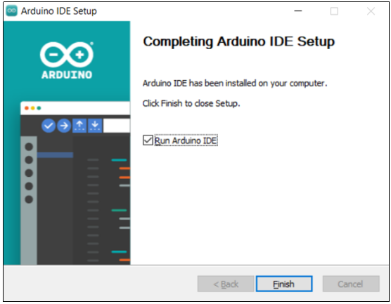

# UNO R4 Arduino IDE Tutorial

## Windown System

### 1. Download and Install IDE

1\. download Arduino IDE (Arduino IDE2.1.1 and later versions support UNO R4).

For old version of Arduino IDE, press Ctrl+ Shift+P and execute “Arduino: Check for Arduino IDE Updates” command.

Or direct to download the latest version at [Arduino IDE](https://www.arduino.cc/en/software). 

Click "JUST DOWNLOAD" .

Click "JUST DOWNLOAD" again to download the package of **arduino-ide_2.3.2_Windows_64bit.exe** .

Downloaded:

2\. Install Arduino IDE.

Click the package of **arduino-ide_2.3.2_Windows_64bit.exe** and you will see an interface, please click "I Agree" .

Tick "Anyone who uses this computer (all users)", and "Next" .

Click "Browse..." to choose a path for installation. Disk C is recommended. After that, click "Install".

Installed:

3\. Open Arduino IDE.

 -- Used to check for any compilation errors.

 -- Used to upload programs to the Arduino board.

 -- Used for single-step debugging while writing programs.

 -- Used to receive serial data from the board and send them to the serial monitor of the board.

 -- Used to convert the data received by the serial port into a dynamic graph.

 -- Used to open a recently saved sample Sketch.

 -- Used to manually install the development board.

 -- Used to manually install library files.

## 2. Install Arduino UNO R4 Board Package

1\. Click  to open “BOARDS MANAGER”. Search “UNO R4” to “INSTALL” Arduino UNO R4.

2\. In “Tools” → “Board”, Arduino UNO R4 boards includes two options: “Arduino UNO R4 WiFi” and “Arduino UNO R4 Minima”.

If you connect the UNO R4 WiFi Board to your computer via USB cable, choose “Arduino UNO R4 WiFi”:

If you connect UNO R4 Minima board to the computer via USB cable, choose “Arduino UNO R4 Minima”:

## 3. Compile and Upload Sketch

1\. For the first use of Arduino UNO R4 board, there may be no port after plugging USB cable. Click “Tools” → “Port” and you will see “COM1”. Here we take “Arduino UNO R4 WIFI” to have a demonstration.

2\. Wait for a while and Arduino UNO R4 driver will be installed automatically. After that, open “Tools” → “Port” and you will see “COM 7(Arduino UNO R4 WIFI)”. Choose this port.

3\. Run program “File”→“Examples”→“01 Basics”→“Blink”, which can be executed without any external library.

4\. Click  to upload the program to UNO R4 WiFi board, and the on-board LED-L blinks.

**For how to upload code to UNO R4 Minima board, please refer to the above steps**. 

## MacOS System

### 1. Download and Install IDE

Choose the macOS version of Arduino IDE, and its method of download and install are similar to that of Windows.

Once the download is complete, click it and follow the prompts to install.

**Special Reminder：** Other operations can refer to the relevant content of the Windown system above.
